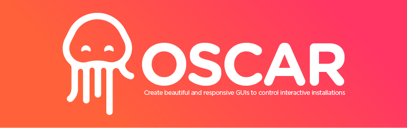

# OSCAR - [Web Version](https://trafalmejo.github.io/OSCAR/)

OSCAR is a tool to create beautiful graphic user interaces (GUIs) to send OSC messages and control interactive installations ([Resolume arena](https://resolume.com/), [TouchDesigner](https://derivative.ca/), [Ableton Live](https://www.ableton.com/), [Processing](https://processing.org/), [Pure Data](https://puredata.info/), [Unity](https://unity.com/), [Unreal Engine](https://www.unrealengine.com/en-US/), etc).
Let's create beautiful, responsive and touchable interfaces.

We are still under construction and this is a quick <a href="https://www.youtube.com/watch?v=ZcW8zBWRLf0" target="_blank">VIDEO</a> DEMO of what the tool is currently able to do, but is up to you to support with feedback, documentation, suggestions, bugs detection to create a better tool.

### Please [Sign Up](https://forms.gle/1pGiDJDh3jur8Tq68) in the BETA user test list to keep you posted about the next release.

## App Setup

Created with [Node.js](https://nodejs.org/en/)/[Express](https://expressjs.com/). Main libraries: Grapesjs, socket.io.js, pkg.

If you want to use this implementation for your own purposes try the following steps:

  1. Clone or download this [repository](https://github.com/trafalmejo/OSCAR/)
  2. Go into the folder you just download
  3. run `npm start`
  4. run `node server.js`
  5. Open a browser on `http://localhost:8080/` (Preferably Google Chrome)

## Tutorials

  1. Youtube Channel [OSCAR](https://www.youtube.com/channel/UCyIxOoajn_4Nj8Mjz2k-3qA)

## Download

  1. Go to [releases](https://github.com/trafalmejo/OSCAR/releases) and download the lastest version for your OS.
  2. Unzip the compressed file
  3. Double-click on the Oscar executable file
  4. Your default browser will open in the URL: [http://localhost:8080](http://localhost:8080) or http://[your local ip]:8080

Be sure your firewall and router allow communication between devices.

## License

BSD 3-clause
