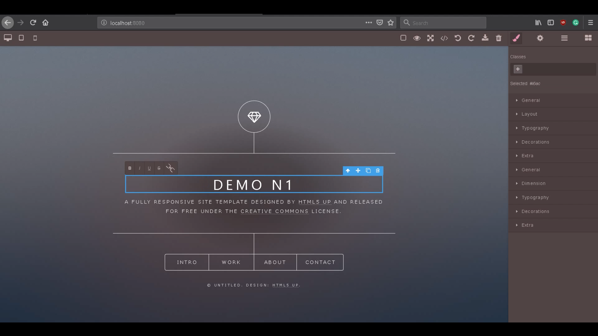

# OSCar[UNDER CONSTRUCTION]

[Web Version](https://trafalmejo.github.io/OSCar/)
OSCar is a tool to create GUI that sends OSC messages to control interactive software (Resolume arena, Touch Designer, Ableton, Processing, PD, UNITY, Unreal, etc)
This way you can create beautiful, responsive and touchable interfaces.

You can find a little video of OSCar sending OSC to TouchDESIGNER: 

https://www.youtube.com/watch?v=ZcW8zBWRLf0

https://www.youtube.com/watch?v=8qewT1OmMdo

## App Setup

Created with node.js/express. Main libraries: Grapesjs, socket.io.js

I also added [nodemon](https://nodemon.io/) to develop with greater ease locally.

If you want to use this implementation for your own purposes try the following steps:

  1. Clone or download this repository
  2. Go into the folder you just clone/download
  2. run `npm install`
  3. run `nodemon server.js`
  4. Open a browser on `http://localhost:8080/`
