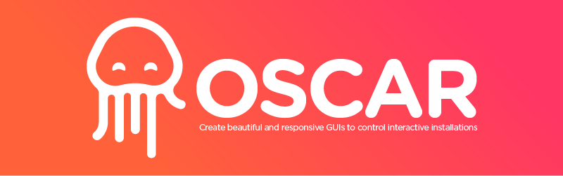

# OSCAR - Visit [our website](https://www.createwithoscar.com/)

OSCAR is a tool to create beautiful graphical user interaces (GUIs) to send OSC messages and control interactive installations ([Modul8](https://www.garagecube.com/modul8/), [MapMapper](https://madmapper.com/), [Resolume arena](https://resolume.com/), [TouchDesigner](https://derivative.ca/), [Ableton Live](https://www.ableton.com/), [Processing](https://processing.org/), [Pure Data](https://puredata.info/), [Unity](https://unity.com/), [Unreal Engine](https://www.unrealengine.com/en-US/), etc).
Let's create beautiful, responsive and touchable interfaces.

Build a layout in the browser, drop in buttons and sliders, point each one at an IP, port and OSC address, then open the same page from a phone or tablet on the same network and use it as a control surface.

<a href="https://www.youtube.com/watch?v=JO6r7gUNlgo&list=PLScMjUz4HRHxxDL2OYcNCMCsD-srohkIW" target="_blank"></a>

## Download

Get the installer for your machine from the
[latest release](https://github.com/trafalmejo/OSCAR/releases/latest):

| Your machine | File |
| --- | --- |
| **Windows** (most PCs) | `OSCAR-*-win-x64.exe` |
| **Windows on ARM** (Snapdragon laptops) | `OSCAR-*-win-arm64.exe` |
| **Mac** with Apple Silicon (M1 and later) | `OSCAR-*-mac-arm64.dmg` |
| **Mac** with an Intel processor | `OSCAR-*-mac-x64.dmg` |
| **Linux** (most distributions) | `OSCAR-*-linux-x86_64.AppImage` |
| **Linux** (Debian, Ubuntu) | `OSCAR-*-linux-amd64.deb` |
| **Raspberry Pi** and other ARM Linux (64-bit OS) | `OSCAR-*-linux-arm64.AppImage` or `OSCAR-*-linux-arm64.deb` |

These builds aren't code signed, so your system warns you the first time. On
Windows, click *More info* then *Run anyway*. On macOS, right-click the app and
choose *Open*.

## Keep in touch

[**Sign up to the OSCAR mailing list**](https://forms.gle/1pGiDJDh3jur8Tq68) to
hear about new releases, features and tutorials.

OSCAR is a free and open source project, and it is better for every bit of
feedback it gets. If you build something with it, we would love to know.

## Running from source

Requires [Node.js 18 or newer](https://nodejs.org/en/).

```bash
git clone https://github.com/trafalmejo/OSCAR
cd OSCAR
npm install     # also installs the browser libraries under public/
npm start       # builds the bundle and starts the server
```

OSCAR opens your browser at `http://localhost:8080` and also prints a LAN
address such as `http://192.168.1.20:8080`. Open that second address on a phone
or tablet on the same Wi-Fi to use the interface as a control surface.

Make sure your firewall allows communication between devices on the network.

### Useful commands

| Command | What it does |
| --- | --- |
| `npm start` | Build the browser bundle, then run the server |
| `npm run serve` | Run the server without rebuilding |
| `npm run serve:at -- 18100` | Run the server on explicit ports (see below) |
| `npm run dev` | Rebuild on change and restart on change |
| `npm test` | Run the test suite |

### Running on explicit ports

To run a second copy of OSCAR on one machine -- while developing next to a
running show, say -- every port has to move, including the two source ports
OSC is sent from. `serve:at` takes the HTTP port and derives the rest from it,
so one number keeps a copy out of everyone else's way:

```bash
npm run serve:at -- 18100                 # http 18100, socket 18101, OSC in 18102, sources 18103/18104
npm run serve:at -- 18100 18101 18102     # the same, with socket and OSC-in ports given explicitly
```

It works the same in PowerShell, cmd and a Unix shell, and does not open a
browser. A port given on the command line always wins, even over an
`OSCAR_HTTP_PORT` left in your shell profile (you are told when that
happens). A port you did not give is derived from the HTTP port unless the
matching `OSCAR_*_PORT` variable is already set, in which case the variable
wins. Two ports landing on the same number, or a value that is not a port,
stop the start with both named. To set ports by hand instead, use the
variables under [Configuration](#configuration):

```bash
OSCAR_HTTP_PORT=8090 OSCAR_SOCKET_PORT=8091 OSCAR_LAN_PORT=5003 OSCAR_LOCAL_PORT=5004 npm run serve
```

A variable set to something that is not a port stops the server with a
message naming it, rather than falling back to the default and colliding with
whatever you were trying to avoid.

### Building a desktop app

OSCAR ships as an Electron app. `npm run electron` runs it from source, and
the `dist` scripts produce installers under `release-builds/`:

| Command | Output |
| --- | --- |
| `npm run electron` | Run the desktop app from source |
| `npm run dist:win` | Windows installer (NSIS) |
| `npm run dist:mac` | macOS disk image |
| `npm run dist:linux` | Linux AppImage and .deb, for x64 and arm64 |

Each platform's installer has to be built on that platform. All three are
built for both Intel (`x64`) and ARM (`arm64`); on Linux the ARM build is what
runs on a Raspberry Pi with a 64-bit OS. Electron no longer ships a 32-bit
Windows build. Icons are generated from `build/icon.png`.

### Cutting a release

Releases are built by GitHub Actions. Pushing a `v*` tag builds OSCAR on
Windows, macOS and Linux in parallel and attaches all the installers to a
**draft** GitHub release, which you then write notes for and publish:

```bash
npm version 2.1.0        # bumps package.json and creates the tag
git push --follow-tags   # builds all three platforms, draft release appears
```

To re-cut the current version in package.json, tag it directly:

```bash
git tag v2.0.0 && git push origin v2.0.0
```

Running the workflow by hand from the Actions tab builds the installers and
leaves them as downloadable run artifacts without creating a release — useful
for checking a build before tagging.

Builds are **not code signed**, so Windows SmartScreen and macOS Gatekeeper
will warn on first run. On macOS, right-click the app and choose Open.

When run as a desktop app, projects are stored in the per-user data folder
(`%APPDATA%/OSCAR/projects` on Windows, `~/Library/Application Support/OSCAR/projects`
on macOS) rather than next to the executable.

### Configuration

All optional, set as environment variables:

| Variable | Default | Purpose |
| --- | --- | --- |
| `OSCAR_HTTP_PORT` | `8080` | Web interface |
| `OSCAR_SOCKET_PORT` | `8081` | Browser-to-server OSC bridge (browsers are told the port) |
| `OSCAR_LAN_PORT` | `5001` | Source port for OSC sent to the network |
| `OSCAR_LOCAL_PORT` | `5002` | Source port for OSC sent to this machine |
| `OSCAR_OSC_IN_PORT` | `9000` | Where OSC coming back from the rig is received |
| `OSCAR_DMX_PORT` | `0` (any free port) | Source port Art-Net and sACN are sent from; `6454` for a node that insists on it |
| `OSCAR_DMX_HOLD_ON_EXIT` | unset | Set to `1` to leave DMX fixtures on their last look when OSCAR quits, instead of releasing them |
| `OSCAR_PROJECTS_DIR` | `./projects` | Where saved projects are written |
| `OSCAR_NO_OPEN` | unset | Set to `1` to not open a browser on start |
| `OSCAR_NO_UPDATE_CHECK` | unset | Set to `1` to never check for new versions |

### Update checks

Once a day at most, OSCAR asks GitHub whether a newer version has been
released, and shows a dismissible notice in the editor if so. Nothing is
downloaded or installed automatically, and you can skip a version or turn the
check off entirely with `OSCAR_NO_UPDATE_CHECK=1`.

This is the only request OSCAR makes to the internet. It sends nothing about
you or your projects, times out quickly, and failing silently is the expected
case on a venue network with no internet access.

## Widgets

Drag these in from the **OSC** category, then set each one's IP, port and
message in the settings panel (the gear icon).

| Widget | Sends |
| --- | --- |
| **Button** | `max` when pressed, `0` on release. As a toggle, it alternates |
| **Slider** | its value as it moves, with optional inverted range |
| **XY Pad** | both values at once — `/pad 30 70` — or as `/pad/x` and `/pad/y` |

On the XY pad, Y increases upward, and either axis can be inverted. Dragging
sends at most one message per frame, and always sends the exact value where
you let go.

A slider can be **Vertical** from its Orientation setting. A size you have
given a slider with the resize handles is kept when it turns: a wide, short
box makes a squashed vertical control, so switch the orientation first and
resize afterwards, or clear the width and height in the Style Manager.

### Following the rig (OSC in)

OSCAR also receives. It listens for OSC on UDP port `9000`
(`OSCAR_OSC_IN_PORT`), the port TouchOSC and Lemur offer first; point your
software's OSC output at OSCAR's IP and that port. Tick **Listen** on a
widget and it follows whatever arrives at its own Message address: a slider's
thumb moves, an XY pad's handle jumps (`/pad 30 70`, or `/pad/x` and `/pad/y`
in two-message mode), and a toggle button lights up and adopts the state, so
the next press sends the opposite edge. A momentary button only lights up,
because its state is your finger's.

Listen is off by default, so nothing starts moving on its own, and a widget
with **Enabled** off is deaf as well as silent, so you can lay a surface out
while the rig is live. A hand on a control outranks the network: while you
are dragging a slider or a pad, or holding a button, what arrives is ignored
until you let go. A widget never sends in answer to what it hears, so software
that echoes its own state cannot start a loop with OSCAR. A value that cannot
be read as a number is ignored, never treated as `0`. A button that sends no
argument has nothing to follow: a bare address says nothing about its state.

Incoming addresses may be OSC 1.0 patterns -- `/layer*/clip`, `/ch[1-3]`,
`/{play,stop}` -- and reach every widget they match; a widget's own Message is
always taken literally, and always reached by its own exact text, even one
like `/layer[1]/opacity`. Software that answers to the port a message came
from (OSCAR's source ports, `5001` and `5002`) is heard as well, so replies
need no configuration. If the OSC-in port is busy or cannot be opened when
OSCAR starts, it says so and carries on: sending is unaffected.

### Driving lights directly (DMX over Art-Net and sACN)

A button, slider or XY pad can drive lighting fixtures directly, with no
lighting software in between. Set a widget's **Output** to **DMX** (or **OSC
and DMX** to keep driving software at the same time) and the DMX settings
appear below the others:

| Setting | Meaning |
| --- | --- |
| **DMX protocol** | Art-Net (UDP 6454) or sACN / E1.31 (UDP 5568) |
| **DMX node** | The node's address. Blank broadcasts on Art-Net and multicasts on sACN, which every node on that network hears |
| **DMX universe** | `0`-`32767` on Art-Net (the 15-bit Port-Address), `1`-`63999` on sACN |
| **DMX channel** | The first channel of the widget's block, `1`-`512` |
| **DMX channels** | How many channels from there |

A slider sends its level (`0`-`255` across its own Min-Max range, so a slider
labelled 20-2000 still means full at the top; Invert mirrors it). A button
sends full while on and out while off, whatever its Value ON and OFF say for
OSC. An XY pad puts X on the first channel and Y on the next: pan and tilt on
a moving head. Values fill the block in order and the last one repeats, so a
slider over three channels dims an RGB fixture as a whole. A block that would
run past channel 512, or is too narrow for the widget's values, is refused in
the panel and never sent. Output is OSC on every widget until you change it,
so a project made before this existed behaves exactly as it did.

DMX is a stream, not a message: fixtures expect the frame to be repeated, and
an sACN receiver drops a source that goes quiet for 2.5 seconds. So OSCAR
keeps every universe it drives on the air until the widget driving it is
deleted or switched back to OSC, or OSCAR quits, and then hands the channels
back by sending them at zero (on sACN, with the stream-terminated packets the
standard asks for). Several widgets on one universe are merged
highest-takes-precedence where their blocks overlap, as a lighting desk
would. A tablet disconnecting or a phone locking its screen releases nothing:
whatever it last set stays up until something changes it. Quitting OSCAR
releases everything unless `OSCAR_DMX_HOLD_ON_EXIT=1`, for a permanent
installation that should hold its look through a restart. As with OSC, a
value that cannot be read is dropped rather than sent as `0`: a dropped value
must never black a rig out.

Packets leave from any free port (`OSCAR_DMX_PORT`), so OSCAR can run next to
lighting software that itself receives Art-Net on 6454. If the port you pin
cannot be opened, OSCAR says so at startup and everything else still works.

On a computer with more than one network connection -- Wi-Fi for the internet
and a cable to the lighting switch, say, or a virtual machine's adapter -- a
blank node is not enough: the operating system puts a broadcast on one
connection only, usually the one with internet on it, and the node on the
other never hears it. Name the node's address, or the lighting network's own
broadcast address (`2.255.255.255` or `10.255.255.255` for the ranges Art-Net
nodes ship on), and the packets go the right way.

## Running a show

The editor lives at `/`. The control surface lives at `/preview` — the same
layout with every editing tool stripped out, which is what you open on a phone
or tablet.

Press **Push to preview** (the eye icon) to send the current layout to it.
Every device showing `/preview` picks the new layout up straight away; there is
no need to walk over and reload them.

### Locking an installation

By default anyone on the network can open the editor at `/` and change things.
For an installation or a show, press the padlock in the toolbar.

While OSCAR is locked:

- Other devices can still open `/preview` and use the controls
- Visiting `/` from another device sends them to `/preview` instead
- Saving, loading and deleting projects are refused
- Only the computer running OSCAR can edit, or unlock it again

Physical access to that computer is what grants editing, so there is no
password to leak over a venue's network or forget before doors open. The
setting is remembered, so a machine that reboots overnight comes back locked.
`OSCAR_LOCKED=1` starts it locked.

This stops editing, not sending: the OSC bridge stays open, because that is how
the tablets work at all. Anyone who can reach OSCAR can still send OSC to your
rig. If that matters, the answer is a separate network for the control devices,
not a setting in OSCAR.

## Saving your work

The canvas autosaves into your browser as you work.

**Save** and **Load** keep a library of named projects, stored as plain JSON
files in the `projects/` folder next to OSCAR. They are ordinary files, so you
can copy, back up and share them however you like.

> **Note for OSCAR 1.x users:** the old online accounts at
> `account.createwithoscar.com` no longer exist. OSCAR now stores everything on
> your own machine, and no longer asks you to log in.

## How it works

```
Browser (grapesjs editor + OSCAR widgets)
   |  socket.io  :8081
   v
OSCAR server (Node/Express)
   |  UDP
   v
Your lighting / video / sound software
```

Widgets carry their own OSC settings (IP, port, address, value). When you press
a button or move a slider the browser sends that over socket.io to the OSCAR
server, which emits the actual OSC packet over UDP.

## Tutorials

1. Youtube Channel [OSCAR](https://www.youtube.com/channel/UCyIxOoajn_4Nj8Mjz2k-3qA)

## Contributing

Bug reports and pull requests are welcome on the
[issue tracker](https://github.com/trafalmejo/OSCAR/issues), and you can
[sign up for OSCAR news](https://forms.gle/1pGiDJDh3jur8Tq68) to follow along
with what is coming next.

## License

BSD 3-clause

## Meter (level display)

A **Meter** shows a level instead of sending one: an audio level, a fixture's
intensity, a playhead, whatever the rig reports at the address in its Message
setting. It sends nothing, so it has no IP or port, and Listen is on from the
start. Min and Max are the scale, the bar is horizontal or vertical from its
Orientation setting, and Value is where it sits until the first reading
arrives, so you can see the layout before anything is feeding it.

**Peak hold** keeps a marker at the highest recent reading for that many
seconds (`0` turns it off). A reading at or above the marker moves it up at
once; when the hold has passed the marker falls back onto the bar on its own,
whether or not anything new has arrived, so it works with software that only
sends a value when it changes. It falls to the last reading, never to zero: a
meter fed nothing keeps showing its last reading.

A meter never drops to zero on its own. A value that cannot be read as a
number holds the last reading, because an empty bar reports silence on a
channel that may be at full, and a meter with **Enabled** off freezes where
it is rather than emptying.

## Colour picker

The **Colour** widget is the tablet's own colour picker: tap the swatch and
the operating system's picker opens. Dragging inside it sends at most one
message per frame, and closing it sends the exact colour chosen. **Send as**
chooses the shape on the wire and **Range** the scale, because software
disagrees on both:

| Send as | On the wire |
| --- | --- |
| **3 values (r, g, b)** | `/colour 1.0 0.533 0.0` |
| **4 values (r, g, b, a)** | the same with the **Alpha** setting appended |
| **hex string (#rrggbb)** | `/colour "#ff8800"` |

**Range** is `0 to 1` for software that reads a colour parameter as floats
(Resolume) or `0 to 255` for software that reads pixel values (TouchDesigner
and most pixel-minded tools). Alpha is a setting rather than part of the
picker, because no native picker has an alpha channel; it is always typed as
`0`-`1`, whatever Range says, and a blank or unreadable Alpha stops the
message rather than going out as `0`, which is fully transparent. The
**Colour** setting is the swatch's value as a hex code, so a colour can be
typed as well as picked; `#f80` and `f80` both mean `#ff8800`.

With **Output** set to DMX, red, green and blue land on three consecutive
channels, whatever Send as and Range say, so the block is three channels
wide by default and drives an RGB fixture as it stands; over a wider block
the blue repeats, and a narrower one is refused. Alpha never reaches the
fixture. With **Listen** on, a colour arriving at Message fills the swatch
in either shape OSCAR sends -- the hex string, or three channels on the
configured Range, with a fourth ignored. Channels may arrive as numbers or
as numbers spelled as text; three readable numbers are always channels, even
when the first (`"255"`, `"000"`) would also pass for a short hex code. A
colour that cannot be read leaves the swatch as it was: the native control
turns anything it does not understand into black, and a rig sending nonsense
must not black a colour out.

While a colour is being dragged inside the picker the rig is not heard, so
the swatch is not snatched from under the hand. That holds on pickers that
report the colour as it moves (macOS, iOS). A picker that reports only when
it is closed (the Windows dialog, Android) gives the page no sign that it is
open, so a colour arriving meanwhile repaints the swatch behind it; pressing
OK still sends the colour that was picked.

**Argument type** int needs **Range** `0 to 255`. Whole numbers on `0 to 1`
would round every channel to 0 or 1 -- eight colours in all, and a middling
Alpha going out as 0 -- so the panel refuses the combination.
